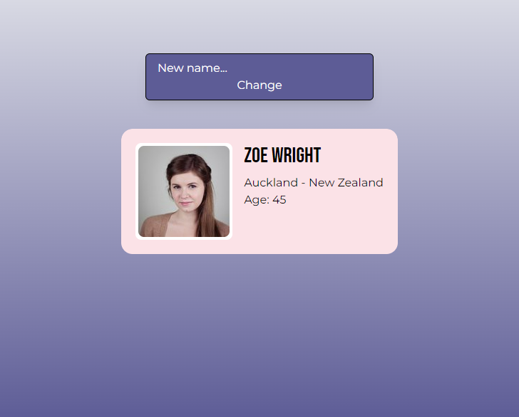
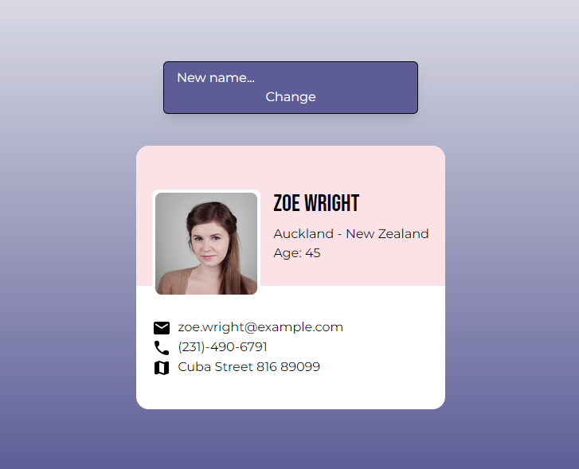
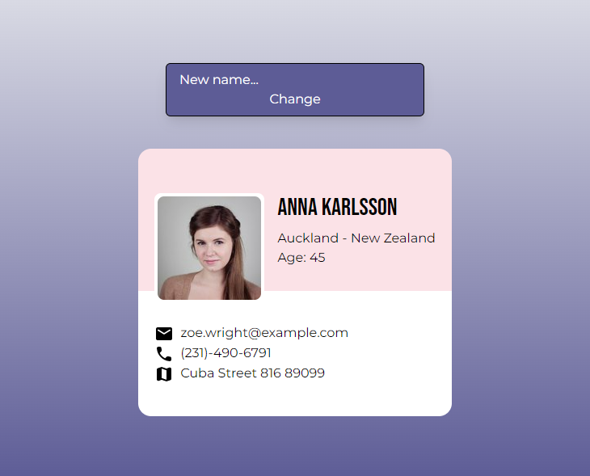

# Random User Viewer App

This is a React application that fetches fake user data from the Random User Generator API and displays it on a user interface. The app allows you to change the name of the user using an input field.

- Utilizes React for building the UI components.
- Uses TypeScript for type safety.
- Implements Tailwind CSS for styling the user interface.
- Uses CSS modules for local scope CSS styling.

[Take a look](https://user-viewer.netlify.app/)

## Features

- Fetches random user data from the Random User Generator API.
- Displays the fetched user data on the user interface.
- Allows the user to change the name of the displayed user using an input field.





## Installation

1.  Clone the repository

```bash
 git clone https://github.com/Luega/ReactTS-user-viewer.git
```

2. Change the working directory

```bash
  cd /ReactTS-user-viewer
```

3. Install dependencies

```bash
  npm install
```

## Usage

1. Start the development server

```bash
npm run start
```

2. Open your browser and visit http://localhost:3000 to see the app in action.

3. The app will automatically fetch random user data from the Random User Generator API and display it on the user interface. You can change the name of the user by typing in the input field provided.

## Technologies

- React - JavaScript library for building user interfaces.
- TypeScript - Typed superset of JavaScript.
- Tailwind CSS - Utility-first CSS framework.
- Random User Generator API - External API for generating random user data.

## License

This project is licensed under the [MIT](https://choosealicense.com/licenses/mit/) License.
